# Sistema de Registro de Usuarios - Coink

Sistema completo de registro de usuarios con arquitectura limpia, stored procedures y frontend responsive.

## 📋 Requisitos Implementados

### Base de Datos
- ✅ Esquema relacional: `app_user`, `country`, `department`, `municipality`
- ✅ Tablas paramétricas para ubicaciones
- ✅ Stored Procedures para todas las operaciones
- ✅ PostgreSQL 15

### Backend C#
- ✅ API REST en .NET 8 con endpoint POST `/api/users`
- ✅ Validaciones en múltiples capas
- ✅ Patrones: Repository, Dependency Injection, DTO, Factory, Service Layer
- ✅ Clean Architecture (4 capas)

### Extras
- ✅ Frontend React + TypeScript + Tailwind CSS responsive
- ✅ Docker Compose para orquestación completa
- ✨ **Actualización de Interfaz (UI):** Mejoras en el layout, buscador integrado y diseño optimizado para móvil y desktop.
- 🗑️ **Borrado Seguro:** Implementación de *Soft Delete* para preservar la integridad de los datos.

---

## 🚀 Cómo Ejecutar

### Requisitos
- Docker Desktop instalado y ejecutándose
- Puertos disponibles: 5000, 5173, 5432

### Configuración Inicial

**1. Inicializar Git (si es un repositorio nuevo)**

```bash
# macOS/Linux
./init-git.sh

# O manualmente:
git init
git add .
git commit -m "Initial commit"
git remote add origin https://github.com/TU_USUARIO/TU_REPOSITORIO.git
git branch -M main
git push -u origin main
```

**2. Crear archivo `.env`**

Copia el archivo `.env.example` y renómbralo a `.env`:

```bash
# macOS/Linux
cp .env.example .env

# Windows (PowerShell)
Copy-Item .env.example .env

# Windows (CMD)
copy .env.example .env
```

Edita `.env` y cambia las contraseñas si lo deseas:
```env
POSTGRES_PASSWORD=tu_contraseña_aquí
DB_PASSWORD=tu_contraseña_aquí
```

### Ejecución

**Clonar desde GitHub (si ya está publicado):**
```bash
git clone https://github.com/TU_USUARIO/TU_REPOSITORIO.git
cd nombre-del-proyecto
cp .env.example .env
# Editar .env con tus contraseñas
```

**macOS/Linux:**
```bash
chmod +x start.sh
./start.sh
```

**Windows:**
```bash
docker compose up --build
```

**Acceder a la aplicación:**
- Frontend: http://localhost:5173
- API: http://localhost:5000/api

> **Nota:** Este proyecto fue desarrollado en macOS pero funciona en cualquier sistema operativo con Docker instalado.

---

## 📁 Estructura

```
coink-test/
├── coink-api/              # Backend .NET (Api, Application, Domain, Infrastructure)
├── coink-front/            # Frontend React + TypeScript
├── sql/                    # Scripts DB (schema, stored procedures, seed)
└── docker-compose.yml      # Orquestación
```

---

## 🌐 API Endpoints

```bash
# Crear usuario
POST /api/users
{
  "name": "Juan Pérez",
  "phone": "3001234567",
  "address": "Calle 123 #45-67",
  "countryId": 1,
  "departmentId": 1,
  "municipalityId": 1
}

# Listar ubicaciones
GET /api/locations/countries
GET /api/locations/departments/{countryId}
GET /api/locations/municipalities/{departmentId}
```

---

## 🏗️ Arquitectura

```
Frontend → API Controllers → Application Services → Domain Entities → Infrastructure Repositories → PostgreSQL (Stored Procedures)
```

**Patrones implementados:** Repository, Dependency Injection, DTO, Factory, Service Layer, Clean Architecture

---

## 🛠️ Tecnologías

- Backend: .NET 8, Dapper
- Base de Datos: PostgreSQL 15
- Frontend: React 19.2, TypeScript 5.9, Tailwind CSS 3.4
- DevOps: Docker, Docker Compose

---

## 🧪 Pruebas Rápidas

```bash
# API
curl http://localhost:5000/api/locations/countries

# Frontend
Abrir http://localhost:5173 y completar formulario
```

- [Arquitectura Detallada](docs/ARCHITECTURE.md)
- [Ejemplos de API](docs/API_EXAMPLES.md)
- [Guía de Despliegue](docs/DEPLOYMENT.md)
- [Checklist del Proyecto](docs/CHECKLIST.md)
- [Screenshots](docs/SCREENSHOTS.md)

---

## 📸 Screenshots

### Interfaz de Usuario (UI Update)
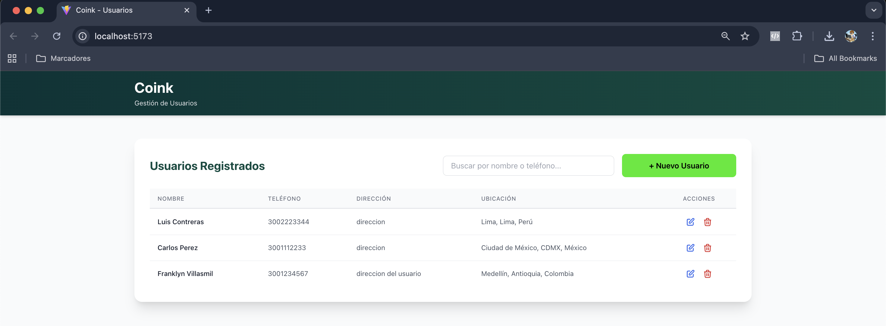
*Nueva vista de listado con buscador y botón de creación alineados*

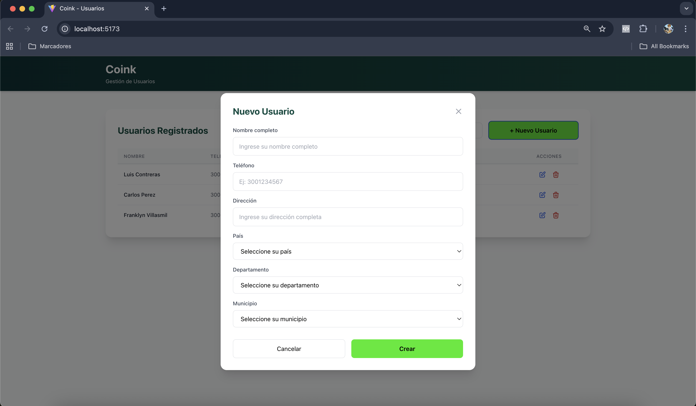
*Modal optimizado para la creación de nuevos usuarios*

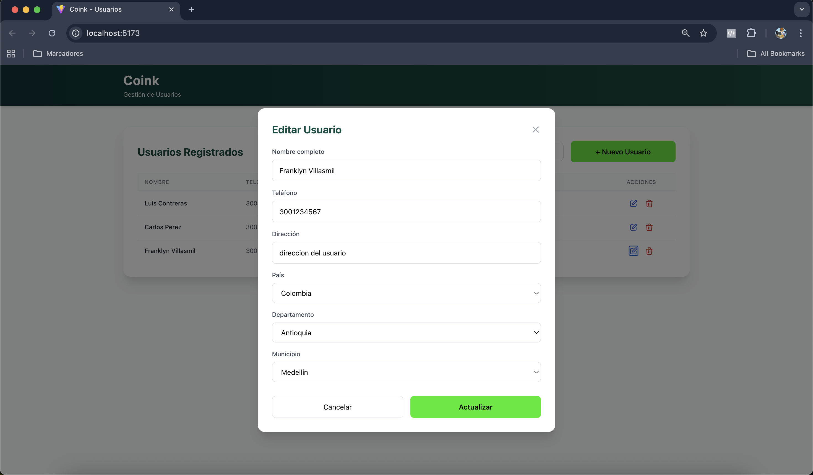
*Modal de edición con precarga completa de datos y ubicaciones*

---

### Frontend Original
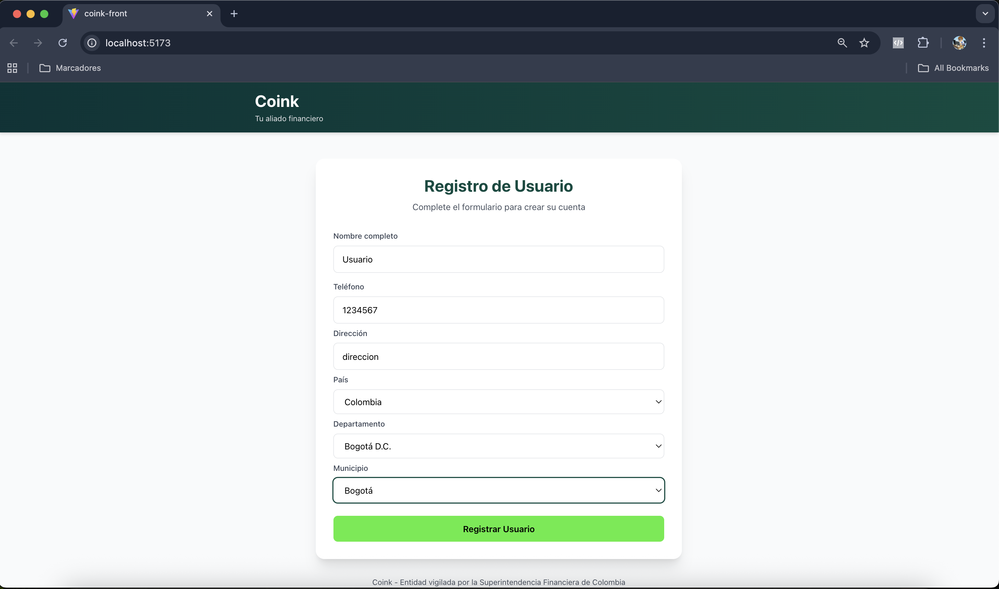
*Formulario de registro original con validaciones*

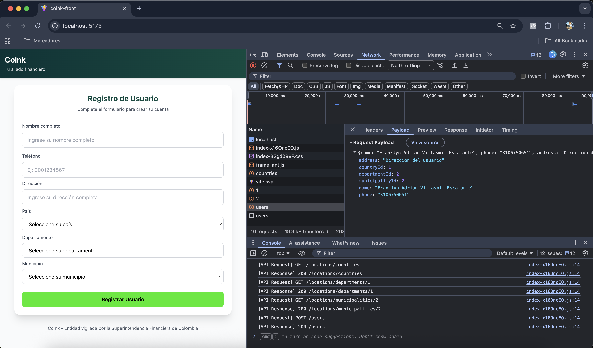
*Aplicación inicial completa*

### Base de Datos
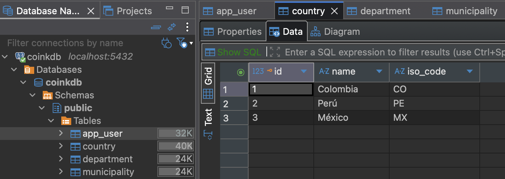
*Tabla de países*

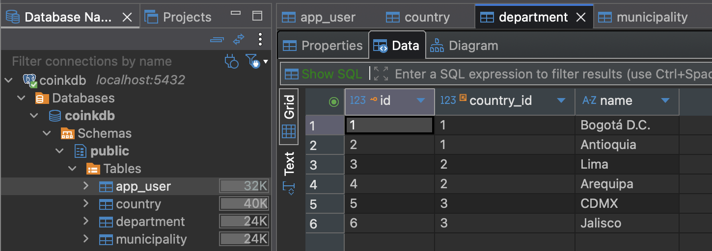
*Tabla de departamentos*

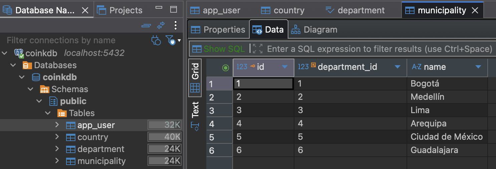
*Tabla de municipios*

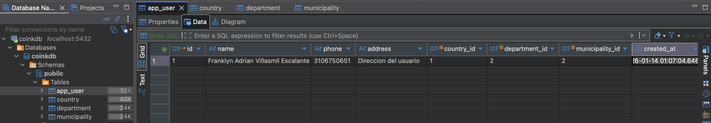
*Tabla de usuarios registrados*

### Docker
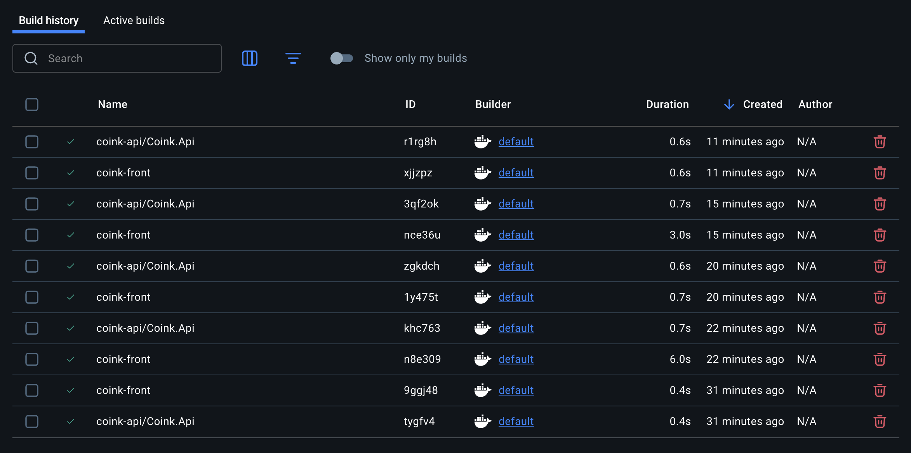
*Construcción de imágenes Docker*

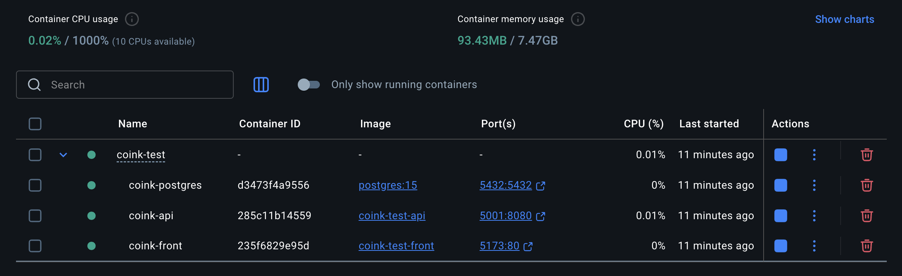
*Contenedores en ejecución*

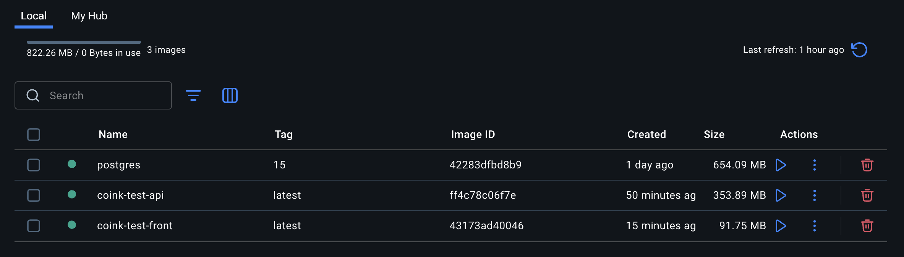
*Imágenes Docker creadas*

---

## 👨‍💻 Autor

**Franklyn Villasmil**  
Prueba Técnica Coink - Enero 2026
